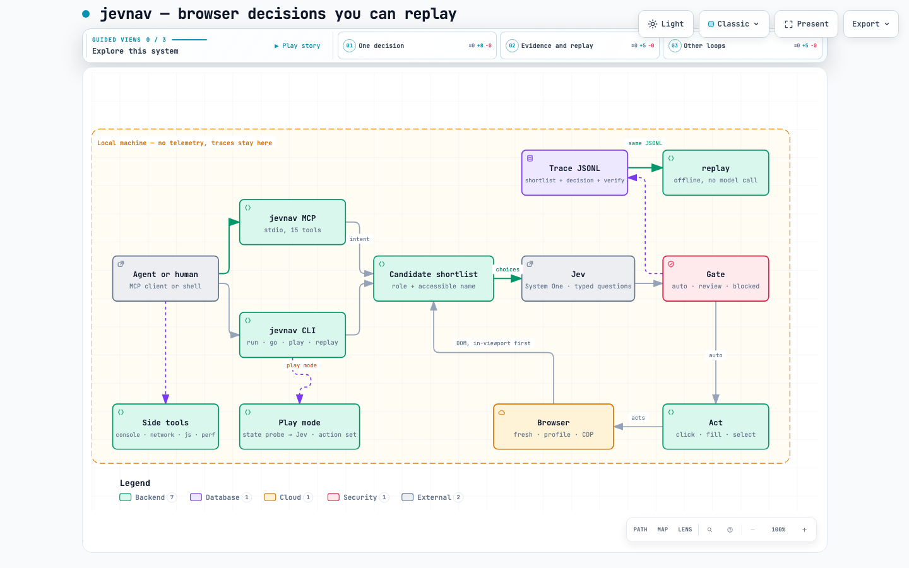

# jevnav

**Browser automation whose decisions you can replay, test and audit.**

[](https://github.com/dtduc-git/jevnav/actions/workflows/ci.yml)
[](https://pypi.org/project/jevnav/)
[](https://pypi.org/project/jevnav/)
[](LICENSE)

Selector-based tests break the moment a label changes, and LLM browser agents
are confident, unauditable and occasionally wrong. jevnav sits in between:

1. **Jev picks the element.** The candidate list of the current page is turned
   into a choice question; the model answers with one element and a calibrated
   probability. In loop mode (``jevnav go``) one request also answers *what to
   do*, *whether the goal is already met* and *which context value to type*.
2. **Every decision is recorded.** The trace holds the candidates as the model
   saw them, the choice, the probability and the cost — one JSONL file per run.
3. **Risky actions are gated.** `p` below the threshold, or an intent that looks
   destructive, goes to a human instead of clicking.
4. **`replay` is the regression test.** Offline, no model call: re-resolve every
   recorded decision against the page as it is now. A site change that breaks a
   target fails CI; everything else is reported as drift, not noise.

## Install

```bash
uv tool install jevnav          # or: pip install jevnav
playwright install chromium     # one-time browser download
```

`jevnav run` needs a TypeSafe API key (`TYPESAFE_API_KEY`, or
`~/.config/typesafe/apikey.txt`). `jevnav replay` needs none — that is the point.

## Quickstart — let Jev drive

```bash
jevnav go --goal "sign in with the demo account and open the pricing page" \
  --start https://app.example.com/login \
  --context email=demo@example.com --context password="${ACME_PASSWORD}" \
  --success "#pricing.visible" \
  --report goal.md
```

```
status: done — outcome verified against the page
steps: 5 — auto 4, review 0, blocked 0
```

One Jev request per step, and every step is gated and traced. The loop stops
when the model says the goal is done, when no listed element can make progress
(`stuck`), when the gate wants a human (`review`), when the page stops changing
(`no_progress`), or at `--max-steps`. `--dry-run` decides without acting.

**`done` is a claim, not evidence.** Pass `--success <selector>` and the claim
is checked against the page: `verified`, `unverified` (the selector is not
there — the run fails), or "not verified" when you passed no selector at all.

## Quickstart — a scripted flow

```yaml
# flows/acme-login/flow.yaml
id: acme-login
start: https://app.example.com/login
steps:
  - intent: "Sign in to the existing account"
    action: click
  - intent: "Type the password"
    action: fill
    value: "${ACME_PASSWORD}"   # read from the environment, never written to the trace
  - intent: "Submit the login form"
    action: click
    expect: "button[type=submit]"   # optional ground truth, used to score the run
```

```bash
jevnav run flows/acme-login/flow.yaml --report run.md
jevnav replay acme-login.trace.jsonl --report replay.md   # offline, deterministic
```

`run` walks the flow: extract candidates → ask Jev → gate → act → record.
`replay` re-checks the trace against the live site, with no model in the loop
(and with `--execute` it re-runs the recorded actions and verifies the recorded
`--success` selector, so a whole agent run becomes a CI test):

```
steps 3  verdicts: ok 3
```

Change `Sign in` to `Log in` on the site and the same replay reports:

```
[01] changed   Sign in to the existing account
      no element now has 'button|sign in' (was 'Sign in' / 'button')
```

Exit code 1, with the reason — that is the CI gate.

## Games (the Doom shape)

A game has no candidate list to extract, so `play` takes the other shape: you
give it a JS state probe and a small action set, and Jev decides at a fixed rate
while the game keeps running — movement keys stay held between decisions, so the
last answer applies while the model thinks. Exactly how Jev plays Doom (fed
structured state as text, ~10 calls/second, no images).

```bash
jevnav play \
  --goal "catch the green blocks, dodge the red ones" \
  --url "examples/game/index.html?seed=7" \
  --state-js examples/game/state.js \
  --actions "left=ArrowLeft" --actions "right=ArrowRight" \
  --rate 4 --seconds 60 --score-js "window.jevnavScore()" \
  --ready-js "() => !!window.jevnavState" \
  --report play.md
```

Measured on the bundled game (`examples/game/`), 60 seconds, three seeds, same
decision rate for both sides:

| seed | random control @3/s | Jev @3/s |
|---|---|---|
| 3 | 0 | 1 |
| 7 | 1 | **6** |
| 11 | 1 | 2 |
| mean | 0.67 | **3.0** |

Jev latency was 312ms p50 from Vietnam, which is what caps the loop at ~3
decisions/second (TypeSafe's Doom demo ran ~10/s from a US network). Run
`--policy random` for your own control, and keep the trace: it is the evidence.

What works where: a DOM game (like the bundled one, or 2048) exposes state to
JS, so a probe is easy. A `<canvas>`/WebGL game — or Flash — has no state in the
DOM; it needs the game itself to expose one (Chocolate Doom WASM does, which is
how the browser Doom agents read it). jevnav still takes no screenshots and
makes no pixel decisions, deliberately: that is what keeps decisions replayable.

## Your own Chrome (logins, cookies, extensions)

Three ways to get a browser:

```bash
jevnav go --goal "..."                      # default: fresh headless Chromium, no cookies
jevnav go --goal "..." --user-data-dir ~/.cache/jevnav-profile --headed
jevnav go --goal "..." --cdp http://127.0.0.1:9222
```

- `--user-data-dir` is a persistent Chromium profile: run once with `--headed`,
  log in by hand, and every later run (headless or not) is already logged in.
  Headful mode needs the full browser: `playwright install chromium`.
- `--cdp` attaches to a Chrome you already have open — your session, your
  extensions, the tab you are looking at. Start it with
  `--remote-debugging-port=9222` (or use `chrome://inspect` to find the port).
  jevnav picks the last real page it finds, and never closes your browser.

Both flags work on `run`, `go`, `replay` and `mcp`. A trace records what was
decided, never which profile was used: cookies and profile paths never reach it.

Use the same freedom for authentication: pass credentials as context and let the
goal fill a login form when a stale cookie would be worse than a fresh login.

## Gates

```yaml
# flows/acme-login/gates.yaml  (optional; sane defaults apply)
min_confidence: 0.9        # scripted flows: one question per step, well calibrated
loop_min_confidence: 0.5   # goal loop: four questions at once, p runs lower
risky:                                  # regular expressions, matched against
  - "\\b(delete|remove|purchase|pay)\\b"   # intent + chosen element name + role
intents:
  "delete the *": { min_confidence: 0.99 }
truncated: review                       # page had more than 255 candidates
```

Three verdicts, no ambiguity:

| verdict | meaning |
|---|---|
| `auto` | confidence at or above the threshold, nothing risky — the action runs |
| `review` | a human confirms first (low `p`, risky intent, truncated candidate list) |
| `blocked` | no decision was possible (model answered `none`, or the call failed) |
| `n/a` | the loop stopped itself (`done`) — no action to gate |

In loop mode the confidence threshold is lower on purpose. Measured
2026-09-21: correct loop decisions land at p 0.41–0.99 and wrong ones at
0.39–0.47, so p does not separate them. What keeps the loop safe is
deterministic: `fill` on a button is refused before it runs, a field with no
context value is blocked, two steps that change nothing stop the run, risky
patterns always go to review, and the outcome is verified against `--success`.

## MCP — for other LLMs

jevnav runs its own browser and exposes it as an MCP server, so a coding agent
(Claude Code, Codex, Cursor, anything that speaks MCP over stdio) can drive a
page through Jev decisions instead of writing selectors:

```bash
pip install "jevnav[mcp]"
jevnav mcp          # that is the whole setup: no URL, no trace path, no flags
```

No URL is needed: the agent opens pages itself with `goto(url)`, so **one server
serves every domain** — a session can visit several sites, in several tabs. The
session writes `jevnav-session.trace.jsonl` in the client's working directory by
default (previous sessions are archived beside it, `--no-trace` opts out), so
every session is auditable without configuring anything.

`--start <url>` exists only as a convenience for a project-scoped config that
always begins on one page; put it in that project's config, not in your global
one. Same for the per-install choices: `--browser`, `--user-data-dir` (log in to
any number of sites once, in one profile), `--cdp`, `--locale`, `--timezone`.

Tools:

**Deciding** — the part no other browser MCP has:

| tool | what it does |
|---|---|
| `browse(intent, action, value, min_confidence)` | one step: Jev picks the element, the gate decides, and only `auto` acts |
| `goal(goal, context_json, max_steps, success)` | drive the whole way: "sign in and open billing" — `success` verifies the outcome; returns `done` / `stuck` / `review` plus the verification |
| `goto(url)` | open a page |
| `page_state()` | URL, title and the shortlist jevnav can see |
| `summary()` | this session: steps, auto/review/blocked, cost, latency |

**Acting** — everything else an agent needs:

| tool | what it does |
|---|---|
| `screenshot(path, full_page, selector)` | save a PNG for a human (never used by a decision) |
| `upload_files(paths, selector, intent)` | set files, on a selector or an input Jev picks |
| `drag(source_selector, target_selector)` | drag one element onto another |
| `resize(width, height)` | change the viewport |
| `emulate(color_scheme, media, geolocation, offline, …)` | emulate media, location and connectivity |
| `press_key(key, selector)` | a key or combination ("Control+A"), optionally on an element |
| `fill_form(fields_json)` | fill several fields in one call: {selector\|intent, value, action} |
| `wait_for(text, selector, timeout_ms)` | wait for something to appear |
| `scroll(direction, amount)` | scroll the document |
| `tabs()`, `new_page(url)`, `select_page(i)`, `close_page(i)` | work with tabs |

**Inspecting** — the agent's eyes (observation only, never traced):

| tool | what it does |
|---|---|
| `console(limit, only_errors)` | recent console messages and page errors |
| `network(limit, only_failed)` | recent requests, with statuses |
| `network_detail(index, url_contains)` | one request's headers and body |
| `dialogs()` | alert/confirm/prompt, with the policy or rule that resolved them |
| `dialog_policy(action, match)` | answer future dialogs: the default, or rules by message text |
| `read_js(expression)` | evaluate JS in the page |
| `route(pattern, status, body, abort)` / `unroute(pattern)` | stub or block requests (testing) |
| `trace_start()` / `trace_stop(path)` | a Playwright trace zip for `playwright show-trace` |
| `perf_metrics()`, `heap_snapshot(path)` | Chromium counters and a heap snapshot |
| `emulate(cpu_throttle, network_conditions, …)` | CPU throttling and Slow-3G-style profiles (chromium, via CDP) |
| `lighthouse(url, categories)` | Lighthouse scores, through npx |

Wire it into a client (this JSON shape is what Cursor, Claude Desktop and VS
Code use; Claude Code also accepts
`claude mcp add jevnav -- uvx --from "jevnav[mcp]" jevnav mcp --start <url>`):

```json
{
  "mcpServers": {
    "jevnav": {
      "command": "uvx",
      "args": ["--from", "jevnav[mcp]", "jevnav", "mcp"],
      "env": { "TYPESAFE_API_KEY": "..." }
    }
  }
}
```

Why an agent would: it does not need its own Playwright MCP, it cannot click a
`Delete` by accident (`review` never executes), and its whole session is a
trace that `jevnav replay --execute` can re-run in CI. Cost is about
**$0.00004 and 330ms per step**; `page_state` and `goto` are free.

### Dialogs: answered by rule, not parked

Playwright's sync API must answer a dialog inside its handler. Parking one so a
human can decide later blocks the renderer and the next call never returns
(measured on this codebase, then removed). So jevnav answers from a policy you
set in advance — `dialog_policy("accept", match="delete")` — and records every
dialog with the rule that fired, so the run stays auditable.

### How it differs from the others

| | Playwright (library) | chrome-devtools-mcp | jevnav |
|---|---|---|---|
| who picks the element | a human writes selectors | the LLM, from a snapshot | **Jev**, with a calibrated probability |
| scope | the full test-authoring API | 29 tools, primitives + profiling | 27 tools, intent-level acting + observation |
| risky actions | whatever the test says | whatever the LLM says | **never executed** until a human says so |
| regression evidence | trace viewer, re-run the test | none | **decision trace + offline replay that exits 1** |
| outcome assertion | `expect(...)` | none | `--success` selector, verified or reported unverified |
| engines | chromium, firefox, webkit | chromium | chromium, firefox, webkit (`--browser`) |
| CPU throttling / Slow-3G | ✅ | ✅ | ✅ (chromium, CDP) |
| request headers/body | ✅ | ✅ | ✅ `network_detail` |
| multi-field form fill | ✅ | ✅ `fill_form` | ✅ `fill_form` (selector or intent) |
| key combos | ✅ | ✅ `press_key` | ✅ `press_key` |
| per-step cost | 0 | one LLM turn per step (~38k chars of snapshot) | **$0.00004** |

jevnav is not a replacement for either: it is the acting + evidence layer an
agent calls by intent. Playwright is the library you write test suites with
(jevnav is built on it), chrome-devtools is what you reach for to debug a page.
What jevnav adds is the part both lack: a decision that can be reviewed before
it runs, and a run that can be replayed after the site changes.

### When the gate says `review`

`review` is the tool refusing to guess — and it hands back what you need to
resolve it: the runners-up with their probabilities and a hint. Measured on
Wikipedia's main page (254 candidates):

1. `goal("search Wikipedia for ...")` → `review` at p=0.33 — the page has two
   plausible ways to submit, so nothing was clicked.
2. The caller re-reads the page and calls `browse("Click the Search button that
   submits the search form in the site header", "click", min_confidence=0.8)`
   → **auto at p=0.95**, clicked for real.
3. `goal(...)` again → `done`, **verified: true** against `.mw-search-results`.

So: be specific, and if you know the page better than the model does, set your
own `min_confidence` — the confidence bar is the caller's call. Risky patterns,
role/value validation and the outcome check are not overridable.

The stdio path is tested end-to-end in CI: a real MCP client connects to a
`jevnav mcp` subprocess, lists the tools, calls `goal` and checks the browser
acted (`tests/test_mcp_server.py`, no network, fake Jev endpoint).

## How it works

- **Candidates are a shortlist, not the page.** Visible interactive elements
  ordered by how likely a human would act on them — in-viewport first, form
  controls before buttons before links — capped at 120 (`--max-candidates`, the
  API's hard cap is 254). Measured on Hacker News (199 elements → 40): same
  accuracy, **2.8× faster** on a cold decision and **3.8× fewer input tokens**.
  Each carries role, accessible name, type, href, placeholder and a scope
  (nearest legend/heading) so three "Email" fields stay distinguishable.
- **Fingerprint.** An element's identity is `role|name` (whitespace- and
  case-normalized). Traces store the fingerprint of every candidate as it was
  shown to the model, so replay never re-derives identity with new code.
- **Decisions.** One choice question per step: the option map is the candidate
  list, plus `none`. The decision is recorded with probabilities, usage and cost.
- **Replay.** Re-extract the page, compare fingerprints. `ok` (found),
  `moved` (found elsewhere on the page), `changed` (gone), `ambiguous` (now
  duplicated), `error`. `changed`, `ambiguous` and `error` fail; `moved` and
  drift counts are reported.
- **Actions.** `click`, `fill`, `select`, `check`, `hover`, `press`, `none`.
  Replay re-runs actions only with `--execute`, and resolves them by
  fingerprint — never by position — so a shifted page cannot click the wrong
  thing.

## Architecture

[](docs/architecture.html)

`docs/architecture.html` is the interactive version (pan, zoom, themes, three
guided views: one decision, evidence and replay, the other loops); the spec it
was built from is `docs/architecture.archify.json`. In one line: the caller
gives an intent, jevnav reads a ranked shortlist from the browser, Jev picks
with a calibrated probability, the gate decides whether that may run unattended,
the action goes back through the DOM, and every step lands in a trace that
`replay` re-resolves offline.

## Benchmarks

`benchmarks/mcp-compare.py` measures jevnav and chrome-devtools-mcp on the same
task (open Hacker News' Newest page), same machine:

| | jevnav | chrome-devtools-mcp |
|---|---|---|
| MCP ready | **22ms** (lazy browser) | 491ms |
| observation the agent must read | **4.8k chars** | 38.3k chars |
| tool calls for the task | 2 | 4 |
| decision cost (real / modelled) | **$0.0008** | $0.057 |
| outcome verified against the page | **yes** (`--success` selector) | no such notion |

With the *same* LLM (deepseek-v4.1-flash via opencode) doing the same tasks,
once per server: HN Newest took **18.0s / 2 calls** with jevnav and 23.5s / 4
calls with chrome-devtools; a Wikipedia search took **18.1s / 2 calls** and
worked, while the chrome-devtools run burned 14 calls in 83s and got HTTP 403
from Wikipedia's robot policy. Small samples, one model — run it yourself with
`uv run --with mcp python benchmarks/mcp-compare.py`.

## Measured

The goal loop, measured on 2026-09-21 (4 goals × 2 wordings × real Jev, local
fixture: sign in, open pricing, sign in then pricing, an impossible goal):
**8/8 goals correct**, including the impossible one (`stuck`), **$0.00004 per
step**, p50 314ms per step. One real run — sign in then open pricing — took 5
steps, $0.000214, and replayed offline with `--execute`: 5/5 targets resolved,
outcome verified.

The element-decision spike (44 decisions: local fixtures, Hacker News, PyPI,
Wikipedia):

- **44/44** decisions correct; **28/28** at `p ≥ 0.9` (the auto gate).
- Replay caught **4/4** injected DOM changes with **0** false alarms on the
  unchanged pages.
- Latency p50 **334ms**, p95 **834ms**; **$0.000053** per decision.
- Asked for an element that does not exist, Jev answered `none` at `p=1.0`
  and `p=0.92` instead of inventing one.

Small sample, self-graded ground truth, easy intents — treat these as direction,
not proof. `replay` is the number that matters in CI, and it is deterministic.

## Non-goals

- No planner and no agent loop — you (or your agent) decide *what* to do; jevnav
  decides *where* and records why.
- No screenshots in the decision loop, no text generation (`fill` takes the text
  from your flow or your environment).
- No iframes, shadow DOM, canvas or file pickers in v0.1 — long tail, tracked as
  issues rather than half-supported.
- No SaaS, no hosted runner, no telemetry. Local-first: nothing leaves the
  machine except the question sent to your configured Jev endpoint.

## Privacy

Traces contain page URLs, element names and your actions — never screenshots.
Loop mode also sends a short digest of the page's visible text (it is how the
model judges whether the goal is done) and the current value of form fields
(passwords masked) — that is what any browser agent has to observe. Scripted
flows send neither. Literal `value`s from the flow are recorded (they are already in
your repo); `${ENV}` values are recorded as the variable name only. Traces are
gitignored by default; audit one before sharing it.

## Suite

jevnav is the browser piece of a verification stack: [mcplint](https://github.com/dtduc-git/mcplint)
(MCP configs), [harnessguard](https://github.com/dtduc-git/harnessguard) (agent
harnesses), [jevassert](https://github.com/dtduc-git/jevassert) +
[jev-packs](https://github.com/dtduc-git/jev-packs) (calibrated decision
packs), and [jev-table](https://github.com/dtduc-git/jev-table).

## License

Apache-2.0.
