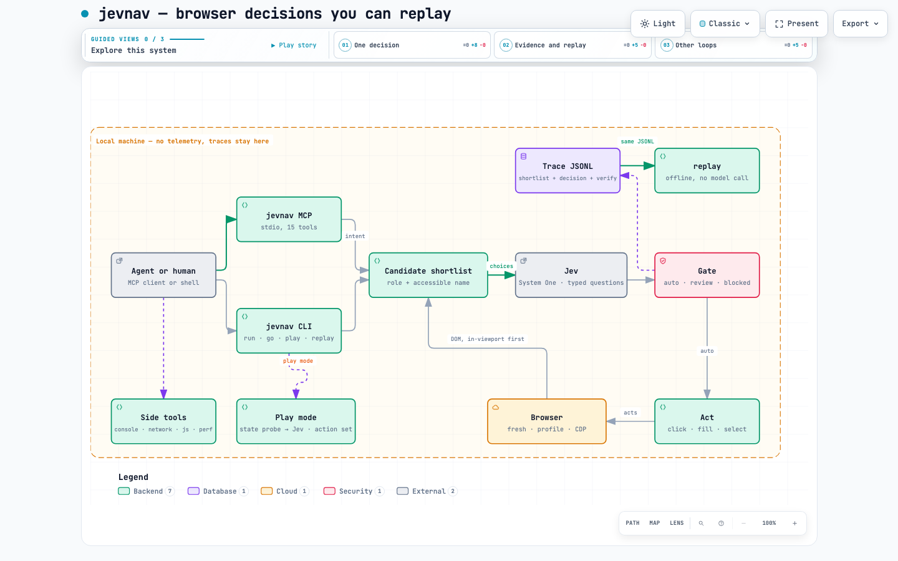

# jevnav

<!-- mcp-name: io.github.dtduc-git/jevnav -->

**Page truth for browser agents — and decisions that replay, test and audit.**

[](https://github.com/dtduc-git/jevnav/actions/workflows/ci.yml)
[](https://pypi.org/project/jevnav/)
[](https://pypi.org/project/jevnav/)
[](https://registry.modelcontextprotocol.io/v0.1/servers?search=io.github.dtduc-git/jevnav)
[](https://github.com/marketplace/actions/jevnav-replay)
[](LICENSE)

jevnav is a browser layer for agents and tests. It reads a page as **facts**
(structure, computed styles, the controls on screen), lets
[Jev](https://docs.typesafe.ai/models) — TypeSafe's model for structured
questions — pick the element for an intent **with a calibrated probability**,
**gates** risky or uncertain actions to a human, and records every decision in a
**trace** that `replay` re-checks offline in CI.

- **Page truth, not pixels.** `outline`, `styles` and `diff` return what the
  browser resolved — `font-size 32px → 28px` between a mockup and the running
  app is something an agent can fix. No screenshots in the decision loop.
- **Evidence, not confidence.** Each decision carries its probability, the gate
  verdict and its cost. A site change that breaks a recorded decision makes
  `replay` exit 1 — no model call, no API key.
- **Works where your agent works.** CLI, Python/pytest, an MCP server for
  Claude Code, Cursor, Codex and friends, and a GitHub Action.

Why it exists — selector tests break when a label changes; LLM browser agents
are confident, unauditable and occasionally wrong: [`docs/why.md`](docs/why.md).

## Install

```bash
uv tool install jevnav          # or: pip install jevnav  (the MCP server is included)
playwright install chromium     # one-time browser download
```

Requires Python 3.10+. Deciding (`go`, `run`, `browse`, `goal`) needs a TypeSafe
API key in `TYPESAFE_API_KEY` or `~/.config/typesafe/apikey.txt`. **`replay`,
`diff`, `outline` and `styles` need no key** — that is the point.

## Quickstart

**1. Let Jev drive** — state a goal and the outcome that proves it:

```bash
jevnav go --goal "sign in with the demo account and open the pricing page" \
  --start https://app.example.com/login \
  --context email=demo@example.com --context password="${ACME_PASSWORD}" \
  --success "#pricing.visible" \
  --report goal.md
```

```
status: done — outcome verified against the page
steps: 5 — auto 4, review 0, blocked 0
```

One Jev request per step; every step is gated and traced. The loop stops when
the goal is met, when nothing on the page can make progress (`stuck`), when the
gate wants a human (`review`), when the page stops changing (`no_progress`), or
at `--max-steps`. `done` is a claim — `--success` turns it into evidence
(`verified`, or `unverified` and the run fails). `--dry-run` decides without
acting.

**2. Or script the flow** and let Jev resolve each intent:

```yaml
# flows/acme-login/flow.yaml
id: acme-login
start: https://app.example.com/login
steps:
  - intent: "Sign in to the existing account"
    action: click
  - intent: "Type the password"
    action: fill
    value: "${ACME_PASSWORD}"   # read from the environment, never written to the trace
  - intent: "Submit the login form"
    action: click
```

```bash
jevnav run flows/acme-login/flow.yaml --report run.md
```

**3. Replay it in CI** — offline, deterministic, no key:

```bash
jevnav replay acme-login.trace.jsonl            # re-resolve every recorded decision
jevnav replay acme-login.trace.jsonl --execute  # also re-run the actions + check --success
```

```
steps 3  verdicts: ok 3
```

Change `Sign in` to `Log in` on the site and the same replay fails:

```
[01] changed   Sign in to the existing account
      no element now has 'button|sign in' (was 'Sign in' / 'button')
```

Exit code 1, with the reason. That is the regression test.

## Page truth for your agent

The facts a coding agent needs about a rendered page, without a screenshot:
`outline(selector)` for a region's structure (tags, headings, text, boxes),
`styles(selector, props)` for the computed values, `page_state()` for the
controls jevnav can act on.

`jevnav diff` compares a mockup with the running app as facts and exits 1 on
drift:

```bash
jevnav diff new-ui.html http://localhost:3000 --report ui-diff.md
```

| element | property | mockup | app |
|---|---|---|---|
| h1 [Pricing] | font-size | 32px | 28px |
| button#cta [Start free] | border-radius | 8px | 4px |

The report also lists structure differences (missing, new and moved elements;
boxes compared with a 4px `--tolerance`). The loop for "here is a new UI, update
the codebase": the agent reads both pages with jevnav, edits the code itself,
re-runs `diff` until it exits 0, then pins the outcome with
`goal(..., success="<selector>")` so `replay --execute` keeps checking it.
jevnav reports; it never edits your repository and never compares pixels.

## Gates

Every decision gets one of three verdicts:

| verdict | meaning |
|---|---|
| `auto` | confidence at or above the threshold and nothing risky — the action runs |
| `review` | a human confirms first: low `p`, a risky intent, or a truncated candidate list |
| `blocked` | no decision was possible (the model answered `none`, or the call failed) |

`review` and `blocked` never execute. Thresholds and risky patterns live in an
optional `gates.yaml`; defaults ship for nine languages:

```yaml
# flows/acme-login/gates.yaml
min_confidence: 0.9        # scripted flows: one question per step, well calibrated
loop_min_confidence: 0.5   # goal loop: four questions at once, p runs lower
risky:
  - "\\b(delete|remove|purchase|pay)\\b"   # matched against intent + element name + role
intents:
  "delete the *": { min_confidence: 0.99 }
truncated: review          # the page had more than 255 candidates
```

The goal loop uses a lower threshold on purpose: measured correct loop decisions
land at p 0.41–0.99 and wrong ones at 0.39–0.47, so its safety comes from
deterministic checks instead — `fill` on a button is refused, a field with no
context value is blocked, two steps that change nothing stop the run, risky
patterns always go to review, and the outcome is verified against `--success`.

## MCP server

```bash
claude mcp add --scope user jevnav -- uvx jevnav mcp
```

Or, for Cursor, Claude Desktop, VS Code and other clients:

```json
{
  "mcpServers": {
    "jevnav": {
      "command": "uvx",
      "args": ["jevnav", "mcp"],
      "env": { "TYPESAFE_API_KEY": "..." }
    }
  }
}
```

No URL or flags needed: the agent opens pages with `goto`, one server serves
every site, and each session writes an auditable `jevnav-session.trace.jsonl`
(`--no-trace` opts out). The deciding tools are what no other browser MCP has:

| tool | what it does |
|---|---|
| `browse(intent, action, value, min_confidence)` | one step: Jev picks the element, the gate decides, only `auto` acts |
| `goal(goal, context_json, max_steps, success)` | drive the whole way; returns `done` / `stuck` / `review` plus the verification |
| `goto(url)` · `page_state()` · `summary()` | open a page, list what jevnav can act on, session totals |

Plus 28 acting and inspecting tools (forms, keys, uploads, tabs, console,
network, styles, outline, emulation, tracing, Lighthouse), each with MCP
annotations so the host knows which calls change state. A decision costs about
$0.00004 and ~330ms, and the page never enters the LLM's context. Full tool
reference, security flags and when to pick jevnav vs. Playwright or
chrome-devtools-mcp: [`docs/mcp.md`](docs/mcp.md).

## CI — GitHub Action

```yaml
- uses: dtduc-git/jevnav@v0
  with:
    trace: examples/local-demo/demo.trace.jsonl
    execute: "true"          # also re-run the recorded actions
    report: replay.md
```

No model call, no API key, ~30 seconds. Fails when a recorded target changed,
became ambiguous, or a recorded `--success` selector is no longer visible.
Inputs: `trace`, `report`, `execute`, `json`, `version` (default `latest` from
PyPI, or `local` for a checkout). `@v0` floats; pin a release tag such as
`@v0.2.2` for fully reproducible CI.

## pytest

The `jev` fixture ships with the package: an ordinary Playwright test gets Jev
decisions, and every test writes a trace that replays in CI.

```python
def test_sign_in(jev):
    jev.goto("https://app.example.com/login")
    jev.fill("the email address", "demo@example.com")
    jev.fill("the password field", "${DEMO_PASSWORD}")
    jev.click("the sign-in button")
    jev.expect("#welcome")
```

```bash
DEMO_PASSWORD=... pytest --jev-trace-dir=traces
DEMO_PASSWORD=... jevnav replay --execute traces/test_sign_in.trace.jsonl   # offline, no key
```

A `review` verdict fails the test before the action runs, `${VAR}` values are
recorded by name only, and `jev.page` is the real Playwright page for everything
else. Runnable example with a committed trace:
[`examples/pytest-interop/`](examples/pytest-interop/).

## Your own browser

```bash
jevnav go --goal "..."                                          # fresh headless Chromium (default)
jevnav go --goal "..." --user-data-dir ~/.cache/jevnav-profile --headed   # persistent profile
jevnav go --goal "..." --cdp http://127.0.0.1:9222              # attach to a running Chrome
```

Log in once with `--headed` and every later run reuses the profile; `--cdp`
drives the Chrome you already have open, keeps its own settings (so it refuses
`--user-data-dir`, `--locale`, `--timezone` and `--user-agent`) and never
closes it. Both work on `run`,
`go`, `replay` and `mcp`, and so does `--browser` for firefox or webkit (plus
`--locale`, `--timezone`, `--user-agent`). Profile paths and cookies never reach
a trace.

## Evidence

| what | result | source |
|---|---|---|
| element picks on real sites (9 sites, `jev-1.13.0`) | **41/41** scored cases correct; **30/30** at the `p ≥ 0.9` gate | [`research/browser-element-selection.md`](research/browser-element-selection.md) |
| decision latency and cost | p50 365ms, $0.000153 per decision | same |
| goal loop (local fixture, 4 goals × 2 wordings) | **8/8** goals correct, incl. the impossible one (`stuck`) | [`docs/evidence.md`](docs/evidence.md) |
| driving tasks vs. chrome-devtools-mcp (same LLM, n=2) | jevnav 8/8, chrome-devtools-mcp 6/8; chrome-devtools **2.4× faster** end to end | [`research/driving-benchmark.md`](research/driving-benchmark.md) |
| replay | deterministic: offline, no key, exit 1 on a broken decision | run it on your own traces |

Small samples with a single annotator: read them as direction, not proof.
jevnav's advantage is decision cost and evidence, not wall-clock speed on small
pages. Method, caveats and the tool-level comparison:
[`docs/evidence.md`](docs/evidence.md).

## How it works

[](docs/architecture.html)

- **A shortlist, not the page.** Visible interactive elements from every frame
  and open shadow root, ranked by how likely a human would act on them and
  capped at 120 (`--max-candidates`, hard cap 254). Each carries role,
  accessible name, type, href, placeholder and a scope, so three "Email" fields
  stay distinguishable.
- **One question per step.** The shortlist plus `none` becomes a choice
  question; Jev answers with one element and its probability.
- **Fingerprints, never positions.** An element's identity is `role|name`. The
  trace stores every candidate's fingerprint as the model saw it, and actions
  and replay resolve by fingerprint with a uniqueness check, so a shifted page
  cannot click the wrong thing.
- **Replay verdicts.** `ok`, `moved`, `changed`, `ambiguous`, `error` — the last
  three fail. `--normalize REGEX` relaxes known churn such as `Cart (3)` →
  `Cart (4)`; strict is the default.

The trace format is a public contract: [`SPEC.md`](SPEC.md). Interactive
architecture diagram: [`docs/architecture.html`](docs/architecture.html).
Beyond the web: [`docs/games.md`](docs/games.md) (Jev playing a game from
structured state, measured against a random control).

## Non-goals

- **Not a planner.** `go`/`goal` drive toward a goal you state; deciding *what*
  to do stays with you or your agent — jevnav decides *where*, and records why.
- **No pixel decisions.** No screenshots or canvas vision in the decision loop
  (`screenshot` exists for humans), and no text generation — `fill` values come
  from your flow, context or environment.
- **No hosted service, no telemetry.** Nothing leaves the machine except the
  question sent to your configured Jev endpoint.

## Privacy

Traces contain page URLs, element names and your actions — never screenshots.
The goal loop also sends a short digest of the page's visible text and current
form values (passwords masked); scripted flows send neither. `${ENV}` values are
recorded by name only. Add `*.trace.jsonl` to your `.gitignore` and audit a
trace before sharing it. See [`SECURITY.md`](SECURITY.md) for the authority
boundary of the MCP server.

## Suite

jevnav is the browser piece of a verification stack:
[mcplint](https://github.com/dtduc-git/mcplint) (MCP configs),
[harnessguard](https://github.com/dtduc-git/harnessguard) (agent harnesses),
[jevassert](https://github.com/dtduc-git/jevassert) +
[jev-packs](https://github.com/dtduc-git/jev-packs) (calibrated decision packs),
and [jev-table](https://github.com/dtduc-git/jev-table).

## License

Apache-2.0 · [Releases and changelog](https://github.com/dtduc-git/jevnav/releases)
