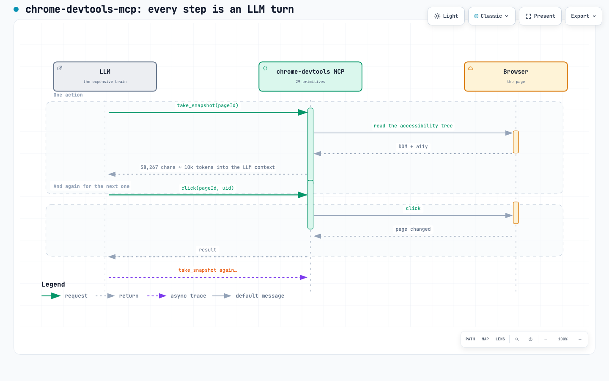
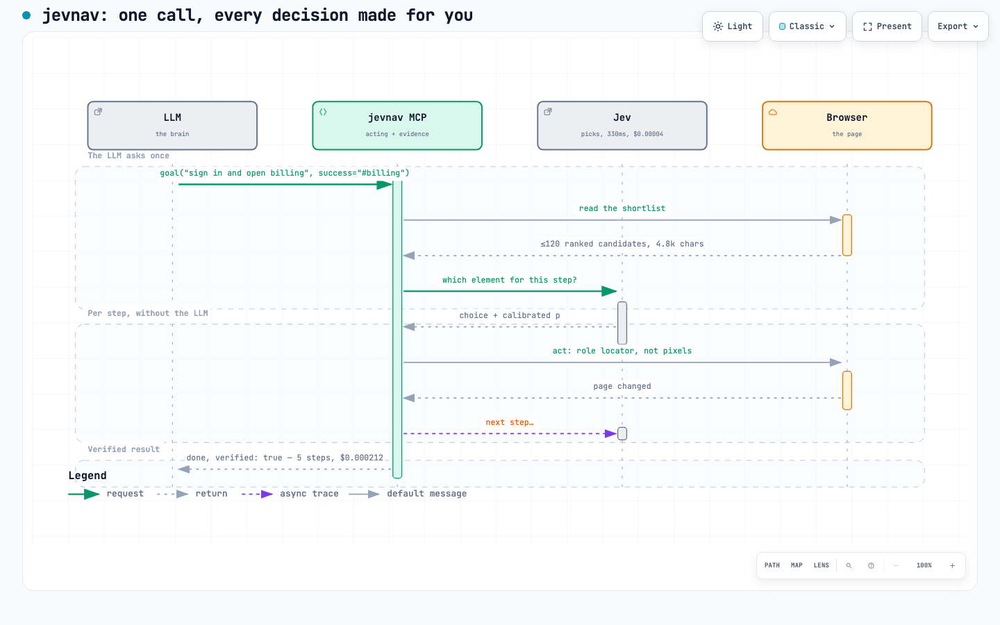

# Evidence: benchmarks and measurements

Everything here is reproducible from the repo; small samples are labelled as such.

## Why the loop is cheaper: two sequences

Same task, different anatomy. With chrome-devtools-mcp the LLM *is* the eyes:
every step it reads a ~38k-character accessibility snapshot into its own context
(~10k tokens on a frontier model), decides the element, clicks, and pays for a
full turn again on the next step. With jevnav the LLM asks once (`goal`), and
each step is a ~330ms, $0.00004 question to Jev over a ≤120-candidate shortlist
that never enters the LLM's context — with a gate in between and a trace written
as it goes. An early one-run sample with the same LLM (deepseek-v4.1-flash via
opencode) is in the git history; do not lean on it — n=1 per server, and its
loudest number came from a robot-policy 403, not from architecture. The
deterministic claim is `replay`, and it needs no benchmark to defend.
Interactive versions of both sequences: `seq-chrome-devtools.html`,
`seq-jevnav.html`.

## Benchmarks

On a *driving* task set (a local ops console: sign-in, a form inside a shadow
root, a table row action, an iframe invoice), same cheap LLM for both servers,
n=2 per task: **jevnav 8/8 tasks, chrome-devtools-mcp 6/8** — and the two
failures were model flakiness, not capability (a manual rerun finished with the
right answer through the shadow root). chrome-devtools was **2.4x faster
end-to-end** (19.3s vs 45.6s mean) with fewer calls. That is the honest
correction to any "faster" claim: jevnav's advantage is *decision cost* and
*evidence*, not wall clock on small pages. Full method and caveats:
`../research/driving-benchmark.md`.

Two more numbers, and only one of them is a comparison.

**Deterministic, and the one to hold jevnav to:** `replay` is offline, needs no
API key, and exits 1 when a recorded decision no longer resolves. There is no
sampling error in that; run it on your own traces.

**Tool-level, and weaker by nature** — `benchmarks/mcp-compare.py`, same machine,
one task, against chrome-devtools-mcp:

| | jevnav | chrome-devtools-mcp |
|---|---|---|
| MCP ready | **22ms** (lazy browser) | 491ms |
| observation the agent must read | **4.8k chars** | 38.3k chars |
| tool calls for the task | 2 | 4 |
| decision cost (real / modelled) | **$0.0008** | $0.057 |
| outcome verified against the page | **yes** (`--success` selector) | no such notion |

An earlier run with the same LLM (deepseek-v4.1-flash via opencode) is on
record in the git history, but do not lean on it: n=1 per server, one model, two
tasks, and the loudest number (a Wikipedia search where chrome-devtools took 83s
and hit HTTP 403) is a robot-policy artifact, not an architectural difference.
The honest version is the table above — what the caller pays per step and how
much of the page lands in the model's context — and even that says nothing about
how the two behave across many sites. What jevnav claims is narrower and provable
on your own pages: a decision at or above the gate is safe to run, and the run
replays.

## Measured

The goal loop, measured on 2026-09-21 (4 goals × 2 wordings × real Jev, local
fixture: sign in, open pricing, sign in then pricing, an impossible goal):
**8/8 goals correct**, including the impossible one (`stuck`), **$0.00004 per
step**, p50 314ms per step. One real run — sign in then open pricing — took 5
steps, $0.000214, and replayed offline with `--execute`: 5/5 targets resolved,
outcome verified.

On real pages (`../research/browser-element-selection.md`, 71 hand-labelled cases
across 9 public sites, one decision each, model `jev-1.13.0`):

- **41/41 scored cases correct**; 30 ran at `p >= 0.9` and **all 30 were right**.
- 365ms p50, **$0.000153 per decision**.
- 71 cases are written, but only 41 scored: the harness refuses labels whose
  selector matches zero or several visible elements, and 30 of the labels did. Small n,
  single annotator, well-built pages: a direction, not a proof. The cases, the
  runner and the excluded-case log are all in the repo.

The build-time element-decision spike (44 decisions: local fixtures, Hacker News,
PyPI, Wikipedia):

- **44/44** decisions correct; **28/28** at `p ≥ 0.9` (the auto gate).
- Replay caught **4/4** injected DOM changes with **0** false alarms on the
  unchanged pages.
- Latency p50 **334ms**, p95 **834ms**; **$0.000053** per decision.
- Asked for an element that does not exist, Jev answered `none` at `p=1.0`
  and `p=0.92` instead of inventing one.

Small sample, self-graded ground truth, easy intents — treat these as direction,
not proof. `replay` is the number that matters in CI, and it is deterministic.
